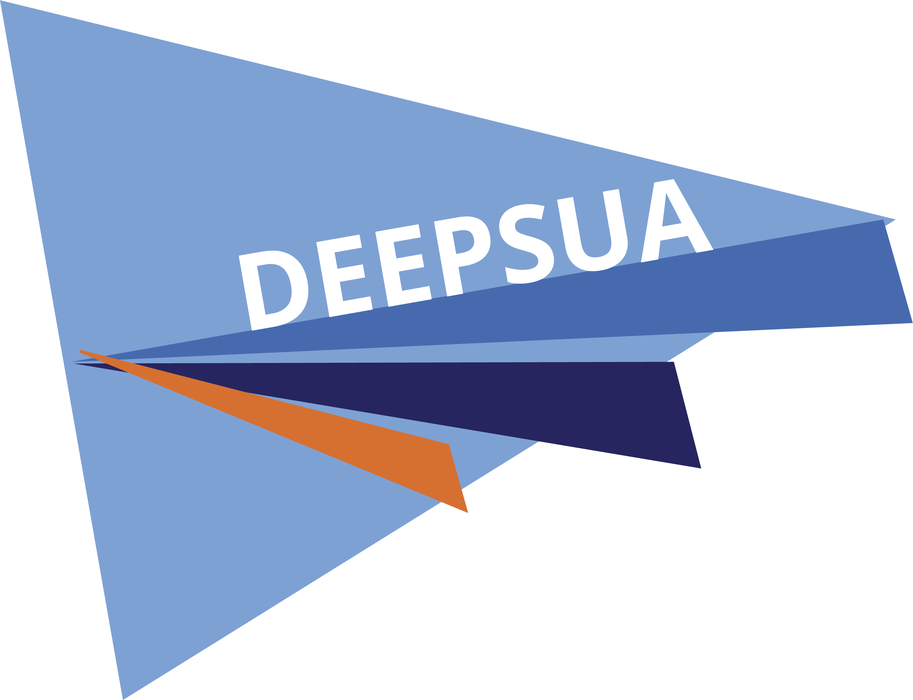

# Formación en GitHub

Repositorio de la formación en GitHub de la Delegación de Estudiantes de la Escuela Politécnica Superior de la Universidad de Alicante (DEEPSUA). El autor del proyecto es Jordi Sellés Enríquez, coordinador del Grado en Ingeniería Informática y secretario del Grupo de Trabajo de Infraestructuras. Este proyecto se ha realizado en el curso 2022-2023.

<!-- Imagen centrada del logo -->

  

## Árbol de contenidos

- [Introducción](intro.md)
- [GitHub Projects y GitHub Issues](projects.md)
- [GitHub Actions](actions.md)
- [GitHub Pages](actions.md#github-pages)

