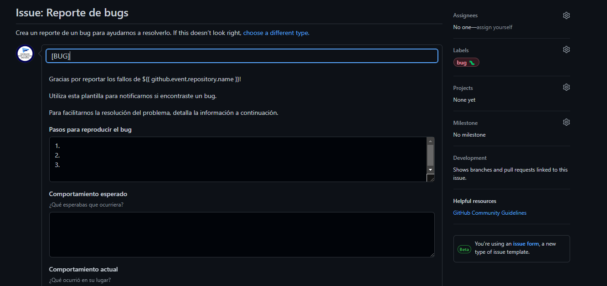

# GitHub Projects y GitHub Issues

## GitHub Projects

GitHub Projects es una herramienta de gestión de proyectos que nos permite organizar nuestro trabajo en proyectos. Nos permite crear tableros de proyectos, que son listas de tareas, y asignar tareas a personas, etiquetas, fechas de vencimiento, etc.

Los proyectos de GitHub se pueden utilizar para organizar el trabajo de un equipo, pero también se pueden utilizar para organizar el trabajo personal. Por ejemplo, podemos crear un proyecto para organizar las tareas que tenemos que realizar en un día, o para organizar las tareas que tenemos que realizar en un curso.

## GitHub Issues

Las tareas se pueden crear como _Issues_ vinculadas a un proyecto, con su correspondiente _milestone_ y _label_. Las _issues_ pueden seguir plantillas y tener _checklists_, y se pueden asignar a personas o grupos de personas pertenecientes a la organización.

Hay un tipo de _Issues_ conocidas como _Pull Requests_ que se utilizan para solicitar cambios en un proyecto, como para solicitar que se incorporen cambios en el código desde la rama de desarrollo a la rama principal. Pueden ser revisadas por otros miembros del equipo y aceptadas o rechazadas, además de poder realizar tests automatizados mediante _GitHub Actions_ para comprobar que el código sigue funcionando correctamente.

Un ejemplo de _Issue_ con plantilla es la siguiente:



### ¿Cómo se puede crear una plantilla?

Para crear una plantilla de _Issue_ hay que crear un archivo en la carpeta `.github/ISSUE_TEMPLATE` con el nombre `reporte_de_bugs.yml`. En este archivo se puede definir la plantilla de la _Issue_. Veamos un ejemplo:

```yaml
name: Reporte de bugs
description: Crea un reporte de un bug para ayudarnos a resolverlo
title: "[BUG]"
labels: ["bug :bug:"]

body:
  - type: markdown
    attributes:
      value: |
        Gracias por reportar los fallos de ${{ github.event.repository.name }}!

        Utiliza esta plantilla para notificarnos si encontraste un bug.

        Para facilitarnos la resolución del problema, detalla la información a continuación.

  - type: textarea
    id: pasos-para-reproducir-el-bug
    attributes:
      label: Pasos para reproducir el bug
      value: |
        1. 
        2.
        3.
    validations:
      required: true
        
  - type: textarea
    id: comportamiento-esperado
    attributes:
      label: Comportamiento esperado
      description: ¿Qué esperabas que ocurriera?
    validations:
      required: true
      
  - type: textarea
    id: comportamiento-actual
    attributes:
      label: Comportamiento actual
      description: ¿Qué ocurrió en su lugar?
    validations:
      required: true
      
  - type: markdown
    attributes:
      value: "### Configuración"

  - type: input
    id: sistema-operativo
    attributes:
      label: Sistema operativo
    validations: 
      required: true

  - type: textarea
    id: versiones
    attributes:
      label: Versión de Python, python-telegram-bot y las dependencias
      description: Copia y pega la salida del comando `$ python -m telegram`. Se formateará automáticamente como código, por lo que no necesitarás añadir ningún tipo de notación.
      render: shell
    validations: 
      required: true
      
  - type: textarea
    id: logs
    attributes:
      label: ¿Qué dicen los logs?
      description: Incluye los logs de error, si los hay. Se formateará automáticamente como código, por lo que no necesitarás añadir ningún tipo de notación.
      render: python

  - type: textarea
    id: contenido-adicional
    attributes:
      label: Contenido adicional
      description: Añade cualquier otro contenido que creas relevante para el reporte del bug.
```

Actualmente, este fichero se encuentra en el repositorio.

